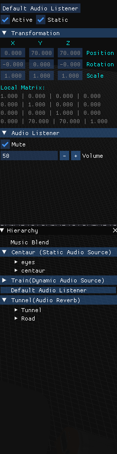

# Irreal Engine
[Irreal Engine](https://github.com/albertmas/GameEngines) is a 3D game engine created by [Albert Mas](https://github.com/albertmas/) and [Guillem Arman](https://github.com/GuillemArman) for the Game Engines university subject at [UPC-CITM](https://www.citm.upc.edu/).

This engine is for university purposes (3D Engines subject).

The subject is divided in three Assignments:

- 1st: Geometry viewer supporting drag & drop and orbital camera.

- 2nd: Remove dependency of FBX, organize resources and applying the minimal optimization of graphics engine(frustum culling and quadtree).

- 3rd:Wwise Integration

Download the latest release [here](https://github.com/albertmas/GameEngines/releases).

## Subsystems
- Engine Structure: Gameobjects with components like transform, mesh and material.
- Mesh Binary Format : We have our own file format for loading assets. We have our importer and exporter with drag & drop.
- GameObject Hierarchy & Inspector: The way our GameObjects are organised and how you can interact with them. Father/Child hierarchy.
- Component Camera: Camera movement using WASD  keys and right mouse. Alt + left click to orbit. Frustum with camera culling.
- In-Game Assets Folder: Search for the assets inside the engine. 
- Mouse Picking: Pixel accurate mouse picking
- Wwise Integration

## Team
 
 
 
Albert Mas : Engine Structue, Mesh Binary Format, Importer, GameObject & Inspector, Camera, Mouse Picking, In-Game Assets Folder, Wwise integration.

Guillem Arman: Engine Structure, Camera, Drag&Drop,  Wwise integration.

##  WWise Integration

On the third assignment we have been integrating [Wwise](https://www.audiokinetic.com/products/wwise/) library in order to use it in our engine. Our main purpose was to be able to prepare a scene with two main background musics that were looping, including one static and one moving gameobject with spatial sound effects and an area where the sound of the moving gameobject would be affected by a reverb effect.

We starting the assignment by including the Wwise SDK in our engine. Once it was done we created the ModuleAudio with a component audiosource and a component listener. 

## Video

## For the development of this engine, we have used the following libraries:
- [DeviceId](https://github.com/MatthewKing/DeviceId) Version Deceber 2015:
Used to detect hardware
- [ImGui](https://github.com/ocornut/imgui) Version 1.66 WIP:
Used to create the UI
- [MathGeoLib](https://github.com/juj/MathGeoLib) Version 2.0:
Used to get math functions and geometric functions
- [SDL](https://www.libsdl.org/) Version 2.0.8:
Used in Graphic rendering and Input detection
- [PCG](http://www.pcg-random.org/) Version 0.9 (Minimal C Implementation):
Random number generator
- [OpenGL](https://www.opengl.org/) Version 4.6.0:
API used to interact with the GPU to render graphics
- [RapidJSON](http://rapidjson.org/index.html) Version 1.1.0:
Fast JSON parcer/generator
- [GLEW](https://github.com/nigels-com/glew) Version 2.0.0:
OpenGL exension library that determines which OpenGL extensions are supported on the target platform
- [Assimp](http://www.assimp.org/) Version 3.3.0:
Used to load FBX meshes
- [DevIL](http://openil.sourceforge.net/) Version 1.8.0:
Used to load textures

## Innovation
We have created a file explorer that can search files in the hard drive and then, if they are a mesh (.FBX) or an image (.dds, .png, .jpg) load them.

